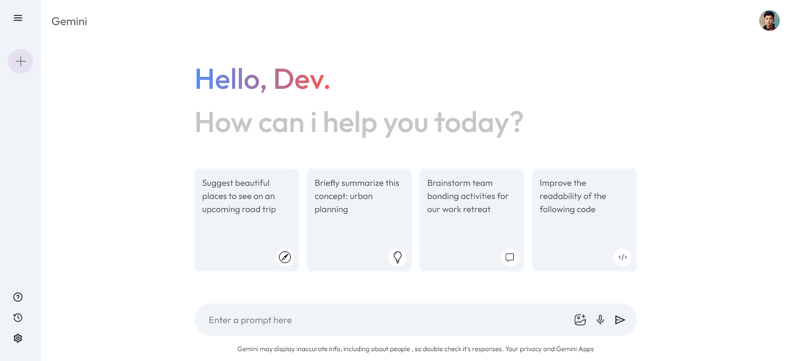

# Gemini Clone Project

## Project Description

This project is a clone of Google's Gemini AI interface, built using React and Vite. It allows users to have conversations with the Gemini AI model through a simple and attractive user interface. The project uses Google's official API to interact with Gemini models.

## Features

- Simple and user-friendly interface similar to the official Gemini interface
- Ability to send text queries to the Gemini AI model
- Display responses with appropriate formatting and support for formatted text
- Gradual typing effect for responses to enhance user experience
- Save history of previous conversations
- Ability to start a new chat
- Collapsible sidebar to display previous conversations

## Technologies Used

- React 19
- Vite
- Google Generative AI API
- Context API for state management
- CSS

## Getting Started

### Prerequisites

- Node.js (version 18 or later)
- API key from Google Generative AI

### Installation

1. Clone the repository:

   git clone https://github.com/mahmoud1mandour/gemini-clone.git
   cd gemini-clone

2. Install dependencies:

   npm install

3. Create a .env file in the root directory and add your API key:
   plaintext

   VITE_GEMINI_API_KEY=your_api_key_here

4. Run the application in development mode:
   bash

   npm run dev

## How to Use

1. Type your query in the input field at the bottom of the screen
2. Click the send icon
3. Wait for the response from Gemini AI
4. You can click on "New Chat" to start a new conversation
5. You can access previous conversations from the sidebar

